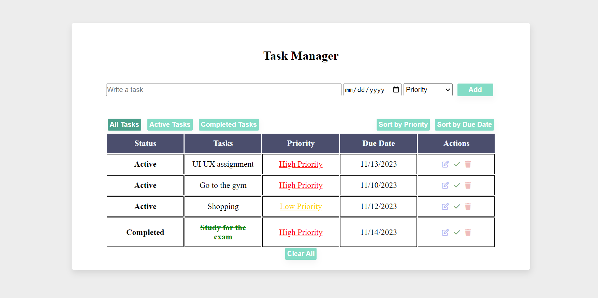

# Task Manager App 📋

This is a lightweight and user-friendly web application designed to streamline your task management. This app allows you to effortlessly add, edit, and organize tasks, providing a clear overview of your to-do list. With features like priority and due date tracking, task sorting, and filtering options, managing your daily activities has never been more convenient. The clean interface ensures a seamless user experience, making task management a breeze.

## Features

- **Add Tasks:** Easily add new tasks with a name, due date, and priority level.
- **Edit Tasks:** Edit task names for better organization.
- **Complete Tasks:** Mark tasks as completed to track your progress.
- **Delete Tasks:** Remove tasks that are no longer needed.
- **Priority and Due Date Tracking:** Set task priorities and due dates for better task management.
- **Sorting and Filtering:** Sort tasks by priority or due date and filter tasks by status (All Tasks, Active Tasks, Completed Tasks).
